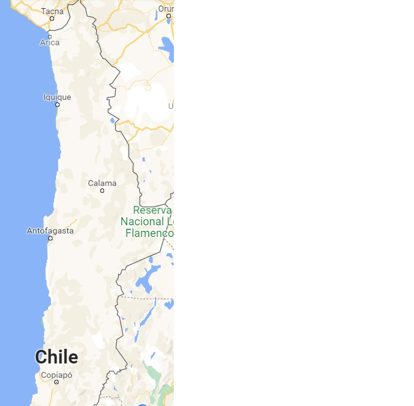

```{r setup, include=FALSE}
knitr::opts_chunk$set(echo = TRUE)
```

```{r, echo=FALSE, message=FALSE}
rm(list=ls())
getwd()

```
```{r, echo=FALSE, message=FALSE}
if (!require('kableExtra')) install.packages('kableExtrar'); library('kableExtra')
if (!require('orloca')) install.packages('orloca'); library('orloca')
if (!require('readr')) install.packages('readr'); library('readr')
```

<div style="text-align: justify">
# Metodología para localización de centro de distribución de una empresa de equipamiento médico utilizando la herramienta OrLoca 
</div>

## 1-Introducción 


<div style="text-align: justify">
La localización de una instalación es el proceso de elegir un lugar geográfico para realizar las operaciones de una empresa. En general se trata de una decisión poco frecuente, de hecho, algunas empresas la toman una sóla vez en su historia. No obstante, la frecuencia de la decisión depende si es una empresa de manufactura o de servicios. es mas habitual tener que localizar puntos de ventas que fábricas y además, una empresa de servicios suele necesitar más de un punto de venta. Este carácter infrecuente hace que los gerentes no estén habituados a tomarlas y esto dificulta la comprensión de su importancia.
La decisión de localización produce un profundo impacto en la organización. Las relaciones con los proveedores se ven tan afectadas como las relaciones con los clientes. Aún en los casos en los que el contacto con el cliente es pasivo (como puede ser el caso de la manufactura) la distancia existente entre el proveedor o cliente y la empresa puede generar dificultades si el tiempo o la distancia entre proveedor / cliente a la empresa es demasiado grande.  
De todas formas, sin lugar  a dudas la localización tiene un impacto significativo en los costos de operación y en consecuencia en su competitividad. 
La estrategia de la organización y su efecto en la cadena de valor debe verse reflejada en la decisión de localización.


La empresa Datamedica SA, con sede en Santiago de Chile, tiene como objetivo la comercialización de equipos médicos para imagenología en todo el territorio chileno, lo que implica un rango de operación de más de 4.000 km desde Arica a Puerto Williams. Dicho equipamiento médico es de mediana a alta complejidad, lo que significa que requiere de la instalación y puesta en marcha en el lugar donde funcionará, además de manutenciones periódicas llevadas a cabo por los especialistas de la empresa, lo que implica numerosos viajes en avión a las regiones alejadas de la capital.
A efectos de reducir costos y mejorar el servicio postventa, la empresa se plantea desplegar una sucursal en la macrozona norte del país para atender a los centros médicos de las ciudades de Arica, Iquique, Calama, Antofagasta y Copiapó.
El objetivo de este trabajo será encontrar el lugar mas adecuado para instalar dicho centro de distribución, utilizando la herramienta OrLoca de R.


Este documento está formado por 5 secciones. En la Introducción en la que se presentó el objetivo. La segunda sección corresponde al Marco Teórico y una breve descripción de la herramienta Orloca. Posteriormente, en la sección del Desarrollo, se muestran los datos del problema y la aplicación de la herramienta. En la cuarta sección se realiza un análisis de los resultados obtenidos y las conclusiones del Trabajo. Finalmente, la quinta y última sección es la correspondiente a la bibliografía consultada.
</div>

## 2- Marco Teórico

> ### Causas que dan origen al problema de localización 

<div style="text-align: justify">
Entre las diversas causas que pueden dar origen a un problema de localización [@dominguez1995direccion] cita, entre otras, a :  

 * Mercado en expansión que hace necesario un aumento de la capacidad de producción.  
 
  * Introducción de nuevos productos, que lleva a un problema análogo al anterior.   
  * Contracción de la demanda, que puede requerir el cierre de instalaciones y hay que determinar cuál es la instalación que debe cerrar.  
  
  * Agotamiento de las fuentes de abastecimiento de las materias, tal el caso de las mineras cuando se agota su fuente debe mudarse otro lugar. 
  
 * Presión de la competencia que puede obligar a abrir otra instalación.  
</div>
 
> ### Importancia de la decisión de localización 

<div style="text-align: justify"> 
La importancia de la de decisión de localización viene dada principalmente por dos razones: por un lado, la localización tiene implícita una importante cantidad de recursos financieros los que una vez construida la instalación en el sitio seleccionado no se recupera fácilmente. Se trata de una decisión rígida que compromete a la empresa en el largo plazo.  
Por otra parte, la localización afecta la competitividad de la empresa. Una buena localización favorecerá el desarrollo eficiente de las operaciones en forma competitiva. Todas las áreas de la empresa pueden verse afectadas por la localización. La influencia de la localización no se ve reflejada únicamente en los costos, sino también sobre los ingresos de la organización. 
  
> ### Factores que afectan las decisiones de localización 

<div style="text-align: justify">
Dado el efecto que tiene la localización sobre los procesos de la organización, es importante considerar distintos factores, al momento de tomar la decisión. algunos autores como [@krajewski2013administracion] indican que dichos factores se encuentran diferenciados si se trata de empresas de manufactura o de servicios. Esto es debido a que los procesos que en dichas organizaciones se desarrollan se ven afectados en manera distinta por la localización.  
En general, los factores más importantes que se deben considerar para la localización de plantas manufactureras o de servicios son:  

* Clima laboral favorable: vinculado a las tarifas salariales, sindicalización, actitud de la comunidad a la fuente de trabajo etc. Este factor es dominante en aquellos casos de la industria de mano de obra intensiva (industria textil, mueblerías, entre otras).  

* Proximidad de los mercados: este factor considera el costo del transporte hasta el cliente. Es muy importante cuando se trata de productos voluminosos o pesados, en cuyo caso, el transporte hasta el cliente implica altas tarifas. En estos casos, localizar la instalación cerca del cliente afecta -disminuye- los costos operativos de la organización.  

* Calidad de vida: es un factor que cada vez está siendo más considerado. Los emplazamientos con instituciones educativas prestigiosas, eventos culturales y estilo de vida atractivo contribuyen a elevar la calidad de vida y suelen ser preferidos.  

* Proximidad a proveedores y recursos: es fundamental para aquellas empresas cuyos insumos son voluminosos, perecederos o pesados, que implican un costo adicional para acercarlos a la organización.  
* Costos de servicios públicos, impuestos y bienes raíces: en muchos casos, también puede ser un factor dominante, la posibilidad de emplazamientos en parques industriales, incentivos del estado, suelen ser considerados como dominantes al momento de la elección.  

* Mano de Obra (MO): la disponibilidad de Mano de Obra capacitada suele ser un factor clave para  aquellas industrias de MO Intensiva.

* Otros factores: posibilidad de expansión, legislación, disposiciones locales tales como la regulación del impacto ambiental, actitud de la comunidad, la climatología, la existencia de suministros básicos, etc.    

>### El proceso de decisión de localización

<div style="text-align: justify">
Determinada la decisión de localización, el primer paso será la formación de un equipo de trabajo, que será el encargado de realizar el estudio. Es deseable la multifuncionalidad del mismo, es decir, que participen representantes de los distintos sectores de la organización.  
El procedimiento a llevarse a cabo para tomar una decisión de localización abarcaría las siguientes fases: 

1. Definición de los criterios de evaluación: aquí se analiza la estrategia y objetivos de la empresa y se traducen en requerimientos de localización. Dada la cantidad de factores que afectan a la localización aquí se deben definir cuáles son los criterios más importantes para evaluar las alternativas. Su definición  dependerá de cómo afectan los mismos en los costes, en los ingresos de la empresa y en su competitividad. En esta fase entonces se determinan los factores o criterios clave que se derivan de la estrategia de la empresa.  

2. Búsqueda de alternativas de localización: se establece un número de localizaciones posibles, descartándose aquellas que no cumplan con alguno de los criterios clave definidos en el proceso anterior  

3. Evaluación de alternativas: En esta fase se recoge toda la información de las distintas alternativas para medirla en función de cada uno de los factores considerados. Esta evaluación puede considerar factores cuantitativos (por ejemplo costo del terreno) como factores cualitativos (actitud de la comunidad).Como resultado de esta fase se obtiene una matriz en la que las distintas alternativas están ponderadas de acuerdo a los criterios seleccionados.  

4. Obtención de las preferencias de las alternativas: en esta etapa final, se acuerda la importancia relativa de los criterios resultando de esta fase, la preferencia relativa de las alternativas. Dado que es poco probable que una localización sea mejor que el resto en todos los criterios, no se busca la solución óptima sino que se busca la mejor. En esta última instancia, los factores mas subjetivos, como pueden ser las preferencias de la dirección determinarán la localización definitiva.


Por último es importante observar que en el entorno dinámico en el cual hoy se desempeñan las organizaciones, los factores determinantes de una localización como las alternativas no permanecen inalterables con el tiempo. Por ejemplo, la automatización de los procesos hacen que el factor MO se vea sensiblemente modificado; la adopción de los sistemas JIT hace que la necesidad de cercanía con el proveedor cambie su importancia; las mejoras en los transportes y las nuevas tecnologías de la información contribuye a la internacionalización de las operaciones, ampliando la posibilidad de las alternativas. 
</div>

### La herramienta Orloca Operations Research LOCational Analysis Models
 
<div style="text-align: justify">
 La herramienta Orloca se basa en el problema presentado por Fermat-Weber, estudiado por varios autores como [@durier1985geometrical], [@weiszfeld2009point]. 
 El paquete RcmdrPlugin.orloca dedicado a resolver el problema de ubicación continua plana, ha sido desarrollado por [@munoz2020package] para R como software gratuito. Resuelve el problema de ubicar un solo punto en el plano, minimizando la suma de las distancias ponderadas a los puntos de demanda
</div>
 
 
## 3. Desarrollo

Se presentan en primera instancia los datos del problema, que incluyen la definición de los criterios y su ponderación y las alternativas de localización. Cabe destacar que para la definición de los criterios se ha integrado un comité multidisciplinario, formado por las distintas partes interesadas de la organización. Posteriormente se realiza la evaluación de las alternativas, considerando los criterios establecidos. Finalmente se aplica la herramienta Orloca y se presentan los resultados obtenidos.
</div>


## 3.1 Datos del problema

>### Definición de alternativas y criterios

<div style="text-align: justify">
Se ha considerado que el mercado del nuevo centro de distribución involucre aquellos clientes localizados en el Norte de Chile. En consecuencia se seleccionan 5 alternativas posibles de localización:

A1: ARICA

A2: CALAMA

A3: IQUIQUE

A4: ANTOFAGASTA

A5: COPIAPÓ


El comité multidisciplinarios acuerda que los siguientes criterios son los mas importantes para definir la localización:


* Población: dado que se carecen de datos reales de demanda, se considerará la cantidad de habitantes como indicativo de la demanda

* Distancia a Santiago de Chile: se considera este factor como claro indicador del costo de la decisión, dadas las características del negocio.

* Suministros básicos (electricidad e internet): este criterio se selcciona por por las características de los bienes que se comercializan y porque se ha pensado en la instalaciÓn de importantes sistemas de información dentro del CD que hacen de Internet un suministro clave

* Accesibilidad: este criterio considera la accesibilidad de las alternativas 

* Mano de Obra: se considera este criterio dado que tanto la maniulacion, puesta en marcha y mantenimiento de los equipos requiere de personal capacitado


* Relieve: este criterio contempla las características del terreno dado que  la entrega al cliente final de los bienes se realiza en vehículos por vía terrestre

* Costo: con este criterio se considera el costo de instalar en centro de distribución: costo del terreno e impositivo. 
</div>


>### Evaluación de las alternativas###

<div style="text-align: justify">
La Tabla 1 presenta los resultados del proceso de ponderación de factores para cada alternativa. 


```{r, echo = FALSE}
tabla1 <- c("ALTERNATIVA", "POBLACIÓN", 	"DISTANCIA A STGO",	"SUMINISTROS BÁSICOS", 	"ACCESIBILIDAD", "RELIEVE",	"MO", "ARICA", 0.19,0.10, 0.18, 0.13, 0.14, 0.10, "CALAMA",	0.15,	0.20,	0.24,	0.19,	0.21,	0.29,"IQUIQUE",	0.17,	0.17,	0.18,	0.13,	0.14,	0.14,"ANTOFAGASTA",	0.34,	0.23,	0.24,	0.25,	0.21,	0.29, "COPIAPO",	0.15,	0.30,	0.18,	0.31,	0.29,	0.19)
tabla1m <- matrix(tabla1,6,7,byrow = TRUE)
kbl(tabla1m, caption = "Tabla 1: Peso de los criterios normalizados", booktabs = T) %>%
kable_styling(latex_options = c("striped", "hold_position"))
```
</div>

>### Definición de la importancia relativa de los criterios  

<div style="text-align: justify">
A efectos de evaluar el comportamiento de la herramienta Orloca se definieron distintas importancias relativas de criterios, vectores w1 a w10. Los valores utilizados se detallan en Tabla 2.
</div>

```{r, echo=FALSE}
tabla2 <- c("POBLACIÓN",	"DISTANCIA A STGO",	"SUMINISTROS BÁSICOS", "ACCESIBILIDAD", 	"RELIEVE","MO", "COSTO", "TERRENO",  "w1",	1,	1,	1,	1,	1,	1, 1, "w2",	5.00,	0.33,	0.33,	0.33,	0.33,	0.33,	0.33, "w3",	0.33,	5.00,	0.33,	0.33,	0.33,	0.33,	0.33, "w4",	0.33,	0.33,	5.00,	0.33,	0.33,	0.33,	0.33, "w5",	0.33,	0.33,	0.33,	5.00,	0.33,	0.33,	0.33, "w6",	0.33,	0.33,	0.33,	0.33,	5.00,	0.33,	0.33, "w7",	0.33,	0.33,	0.33,	0.33,	0.33,	5.00,	0.33, "w8",	0.33,	0.33,	0.33,	0.33,	0.33,	0.33,	5.00, "w9",	3.00,	0.20,	0.20,	0.20,	0.20,	0.20,	3.00, "w10",0.20,	0.20,	3.00,	0.20,	0.20,	3.00,	0.20)

tabla2m <- matrix(tabla2,11,8,byrow = TRUE)

kbl(tabla2m, caption = "Tabla 2: Importancias relativas de los criterios", booktabs = T) %>%
kable_styling(latex_options = c("striped", "hold_position"))
```


>### APLICACION DE LA HERRAMIENTA *ORLOCA*

<div style="text-align: justify">
Se determinaron en primer lugar la localización de las 5 alternativas, que se muestran en el mapa de la zona, Figura 1. 



A partir del mapa se obtuvieron las coordenadas de las alternativas en pixeles.
Seguidamente se define el vector "w" para incorporar al modelo las ponderaciones realizadas a las distintas alternativas. Se analizaron 11 vectores, que surgen de considerar todas las alternativas iguales (wo) y los pesos de los criterios definidos en la Tabla 2. En la Tabla 3 se muestran los vectores w que se aplican en la herramienta. 

```{r, echo=FALSE,message=FALSE}

Tabla3 <- read_delim("Tabla3.csv", ";", escape_double = FALSE, 
    trim_ws = TRUE)

kbl(Tabla3, caption = "Tabla 3: Vectores de ponderación", booktabs = T) %>%
kable_styling(latex_options = c("striped", "hold_position"))
```


Es importante destacar que los valores de "w" han sido asignados a efectos de visualizar claramente como afectan a las localizaciones determinadas por la herramienta. 


La localización se calcula según los 8 algoritmos disponibles de la herramienta: de la versión del paquete que son: "gradient", "ucminf", "Weiszfeld","Nelder-Mead", "BFGS", "CG", "L-BFGS-B"y "SANN". El algoritmo de "Weiszfeld" es el aplicado por defecto.


Se presenta a continuación los códigos utilizados, aplicando el vector w0. 
</div>


#### Creación los vectores de coordenadas "x", "y" y del vector "w0" de pesos


```{r}
x<-c(98,202,113,99,111)

y<-c(728,423,592,330,46)

w0<-c(1,1,1,1,1)

ciudades<- c("Arica", "Calama", "Iquique", "Antofagasta", "Copiapó")
```

#### Calculo del objeto loca.p

```{r}
loca.p(x, y, w0, label= "Chile zona norte")
chile<-loca.p(x, y, w0, label = "Chile zona norte")
```


#### Resumen numérico del objeto Orloca
```{r}
summary(chile)
```

#### Ploteo de los puntos en el mapa de la zona norte de Chile

```{r}
chile_map = ("Chile.png")
img = readPNG(chile_map)
plot(chile, img=img, main="Figura 2: Puntos del objeto loca.p en el mapa Chile zona norte", xleft=0, ybottom=0, xright=800, ytop=800)
```

#### Gráfico de curvas de nivel 

<div style="text-align: justify">
Las curvas de nivel brindan una información fundamental, ya que circunscriben la solución encontrada a una región posible.
La herramienta brinda por defecto la curva de nivel correspondiente a 1500 (Figura 3). Esta zona además se puede amplificar a una zona más cercana al punto (Figura 4).
div>

```{r}
contour(chile, img=img, main="Figura 3: Curvas de nivel en el mapa Chile zona norte", xleft=0, ybottom=0, xright=800, ytop=800)
```

```{r}
contour(chile, img=img, main="Figura 4: Curvas de nivel amplificadas en el mapa Chile zona norte", xleft=0, ybottom=0, xright=800, ytop=800,levels = c(1000, 1100, 1200, 1300, 1400,  1500))
```


#### Cálculo de las Distancias mínimas

###### Solución óptima al problema de localización (algoritmo por defecto)


```{r}
solucion <- distsummin(chile)
solucion
```


###### Solución óptima al problema de localización para el algoritmo gradient

```{r}
solucion1 <- distsummin(chile, Lp= 3,5, algorithm = "gradient" )
solucion1
```

###### Solución óptima al problema de localización para el algoritmo ucminf

```{r}
solucion2 <- distsummin(chile, Lp = 2, algorithm = "ucminf" )
solucion2
```


###### Solución óptima al problema de localización para el algoritmo Nelder-Mead

```{r}
solucion3 <- distsummin(chile, Lp = 2, algorithm = "Nelder-Mead" )
solucion3
```


###### Solución óptima al problema de localización para el algoritmo BFGS

```{r}
solucion4 <- distsummin(chile, Lp = 2, algorithm = "BFGS" )
solucion4
```

###### Solución óptima al problema de localización para el algoritmo CG

```{r}
solucion5 <- distsummin(chile, algorithm = "CG" )
solucion5
```


###### Solución óptima al problema de localización para el algoritmo L-BFGS-B

```{r}
solucion6 <- distsummin(chile, Lp = 2, algorithm = "L-BFGS-B" )
solucion6
```

###### Solución óptima al problema de localización para el algoritmo SANN

```{r}
set.seed(123)
solucion7 <- distsummin(chile, Lp = 2, algorithm = "SANN" )
solucion7
```

###### Distancia media ponderada al punto obtenido

```{r}
distsum(chile, x=solucion[1], y=solucion[2])
distsum(chile, x=solucion1[1], y=solucion1[2])
distsum(chile, x=solucion2[1], y=solucion2[2])
distsum(chile, x=solucion3[1], y=solucion3[2])
distsum(chile, x=solucion4[1], y=solucion4[2])
distsum(chile, x=solucion5[1], y=solucion5[2])
distsum(chile, x=solucion6[1], y=solucion6[2])
distsum(chile, x=solucion7[1], y=solucion7[2])
```

Para los datos ingresados del caso analizado de la empresa Datamedica SA, se desprende de los resultados hallados, que no existen diferencias importantes entre las soluciones arrojadas por los distintos algoritmos.Tampoco se encuentran diferencias entre la norma Euclidea (Lp=2) y otras normas distintas de Lp=2. Si bien se observan muy pequeñas variaciones por la aplicación de los distintos algoritmos,la distancia media ponderada al valor hallado, es prácticamente constante.
Las soluciones halladas para los restantes "w" presentaron un comportamiento similar. 

En consecuencia se presentan en Tabla 4 las soluciones encontradas por el algoritmo por defecto para los distintos "w" presentados en Tabla 3.

```{r, echo=FALSE, message=FALSE}

Tabla4 <- read_delim("Tabla4.csv", ";", escape_double = FALSE, 
    trim_ws = TRUE)

kbl(Tabla4, caption = "Tabla 4: Soluciones para los distintos w", booktabs = T) %>%
kable_styling(latex_options = c("striped", "hold_position"))
```


```{r, echo=FALSE, results='hide',message=FALSE}
Soluciones <- read_delim("Soluciones.csv", 
    ";", escape_double = FALSE, trim_ws = TRUE)

```

```{r, echo=FALSE}
#loca.p(Soluciones$x, Soluciones$y, label= "Soluciones")
Soluciones_loca<-loca.p(Soluciones$x, Soluciones$y, label= "Soluciones")
```

##### Representación en el mapa de Chile zona norte de las distintas soluciones

```{r}
chile_map = ("Chile.png")
img = readPNG(chile_map)
plot(Soluciones_loca, img=img, main="Figura 5: Soluciones de los distintos w", xleft=0, ybottom=0, xright=800, ytop=800)
```
<div style="text-align: justify">
Se observa que las soluciones obtenidas aplicando la herramienta Orloca para los 11 vectores considerados, en todos los cosas fueron cercanas a los resultados de la matriz de los vectores de ponderación (Tabla 3).
</div>

#### Solución Resumen
<div style="text-align: justify">
Se definió una solución resumen que incluye a todas las soluciones encontradas para los distintos pesos 


```{r}
solucion_R <- distsummin(Soluciones_loca)
solucion_R
```

#### Representación en el mapa de Chile zona norte la solución resumen

```{r}
contour(Soluciones_loca, img=img, main="Figura 6: Solución resumen", xleft=0, ybottom=0, xright=800, ytop=800)
points(solucion_R[1], solucion_R[2], type='p', col='red')
```

Se observa que la solución resumen arroja como coordenadas el punto medio de las soluciones encontradas. Se puede decir que en este caso la alternativa sería definir la localización en Antofagasta, ya que el punto encontrado corresponde a una zona de desierto.

</div>

# 4. Conclusiones

<div style="text-align: justify">

No se encontraron diferencias importantes entre las soluciones arrojadas por los distintos algoritmos.Tampoco se hallaron diferencias entre la norma Euclidea (Lp=2) y otras normas distintas de Lp=2. 

Si bien con la matriz de ponderación los decisores pueden encontrar la  alternativa preferida en función de los pesos de los criterios, la aplicación de la herramienta brinda una solución más precisa de la localización buscada.

</div>

# 5. Bibliografía


